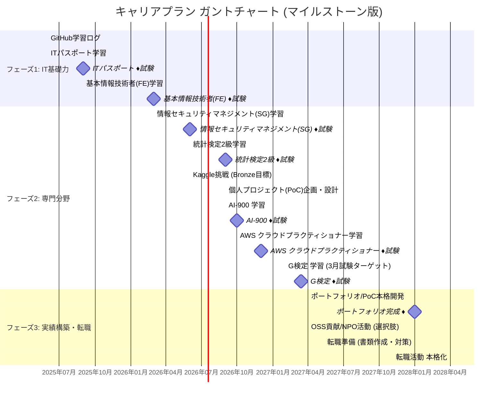

```mermaid
gantt
    title キャリアプラン ガントチャート (マイルストーン版)
    dateFormat  YYYY-MM-DD
    axisFormat %Y年%m月

    %% フェーズ1: IT基礎力の養成と学習習慣の確立
    section フェーズ1: IT基礎力
    GitHub学習ログ           :active,log, 2025-06-01, 36m
    ITパスポート学習         :active,ITP 2025-06-01, 3m
    ITパスポート ♦試験       :milestone, 2025-09-01, 0d
    基本情報技術者(FE)学習   :FE,         2025-09-01, 6m
    基本情報技術者(FE) ♦試験 :milestone, 2026-03-01, 0d

    %% フェーズ2: 専門分野の深化と「個人の実践力」の証明
    section フェーズ2: 専門分野
    情報セキュリティマネジメント(SG)学習 :SG, 2026-03-01, 3m
    情報セキュリティマネジメント(SG) ♦試験 :milestone, 2026-06-01, 0d
    統計検定2級学習                      :stat2, 2026-06-01, 3m
    統計検定2級 ♦試験                    :milestone, 2026-09-01, 0d
    
    %% --- AI・クラウド資格取得と実践 ---
    Kaggle挑戦 (Bronze目標)              :Kaggle, 2026-06-01, 12m
    個人プロジェクト(PoC)企画・設計      :PoC 2026-09-01, 7m
    AI-900 学習                          :AI-900, 2026-09-01, 1m
    AI-900 ♦試験                         :milestone, 2026-10-01, 0d
    AWS クラウドプラクティショナー学習     :AWS-CP 2026-10-01, 2m
    AWS クラウドプラクティショナー ♦試験 :milestone, 2026-12-01, 0d
    G検定 学習 (3月試験ターゲット)       :Gtest 2027-02-01, 1.5m
    G検定 ♦試験                          :milestone, 2027-03-15, 0d

    %% フェーズ3: 実績のポートフォリオ化と転職準備
    section フェーズ3: 実績構築・転職
    ポートフォリオ/PoC本格開発  :port 2027-04-01, 9m
    ポートフォリオ完成 ♦        :milestone, 2028-01-01, 0d
    OSS貢献/NPO活動 (選択肢)    :oss 2027-04-01, 9m
    転職準備 (書類作成・対策)   :jobs 2028-01-01, 3m
    転職活動 本格化             :jobsearch 2028-04-01, 3m
```
