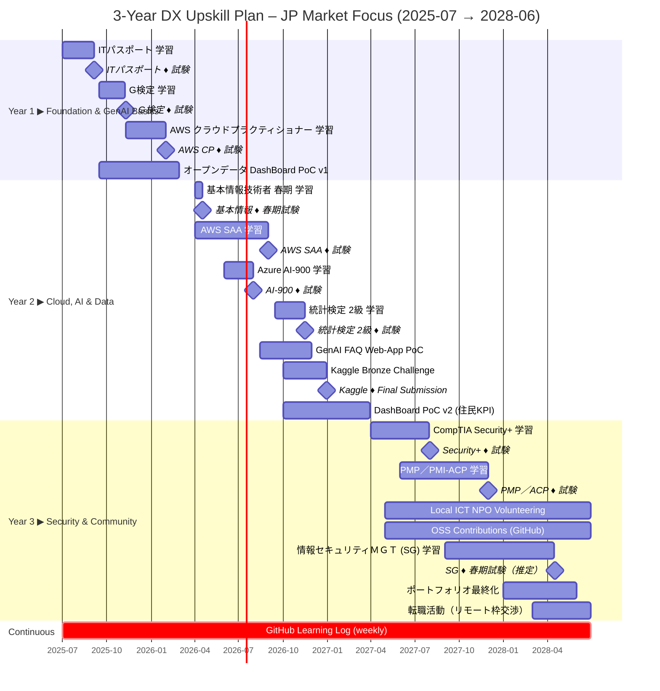

```mermaid
gantt
  title 3-Year DX Upskill Plan – JP Market Focus (2025-07 → 2028-06)
  dateFormat  YYYY-MM-DD
  axisFormat  %Y-%m

  %% ─────────────── Year 1 ───────────────
  section Year 1 ▶ Foundation & GenAI Basics
  ITパスポート 学習                   :itp_st,   2025-07-01, 2025-09-04
  ITパスポート ♦ 試験                 :milestone,itp_ex,  2025-09-05, 0d
  G検定 学習                          :gtest_st, 2025-09-15, 2025-11-08
  G検定 ♦ 試験                        :milestone,gtest_ex,2025-11-09, 0d
  AWS クラウドプラクティショナー 学習  :awscp,    2025-11-10, 2026-01-31
  AWS CP ♦ 試験                       :milestone,awscp_ex,2026-02-01, 0d
  オープンデータ DashBoard PoC v1     :poc1,     2025-09-15, 2026-02-28

  %% ─────────────── Year 2 ───────────────
  section Year 2 ▶ Cloud, AI & Data
  基本情報技術者 春期 学習            :fe_st,    2026-04-01, 2026-04-17
  基本情報 ♦ 春期試験                 :milestone,fe_ex,   2026-04-18, 0d
  AWS SAA 学習                        :saa,      2026-04-01, 2026-08-31
  AWS SAA ♦ 試験                      :milestone,saa_ex,  2026-09-01, 0d
  Azure AI-900 学習                   :ai900,    2026-06-01, 2026-07-31
  AI-900 ♦ 試験                       :milestone,ai900_ex,2026-08-01, 0d
  統計検定 2級 学習                   :stat2,    2026-09-15, 2026-11-15
  統計検定 2級 ♦ 試験                :milestone,stat2_ex,2026-11-16, 0d
  GenAI FAQ Web-App PoC               :faq,      2026-08-15, 2026-11-30
  Kaggle Bronze Challenge             :kaggle,   2026-10-01, 2026-12-30
  Kaggle ♦ Final Submission           :milestone,kaggle_ex,2026-12-31, 0d
  DashBoard PoC v2 (住民KPI)          :poc2,     2026-10-01, 2027-03-31

  %% ─────────────── Year 3 ───────────────
  section Year 3 ▶ Security & Community
  CompTIA Security+ 学習              :secplus,  2027-04-01, 2027-07-31
  Security+ ♦ 試験                    :milestone,secplus_ex,2027-08-01, 0d
  PMP／PMI-ACP 学習                   :pmp,      2027-06-01, 2027-11-30
  PMP／ACP ♦ 試験                     :milestone,pmp_ex,   2027-12-01, 0d
  Local ICT NPO Volunteering          :npo,      2027-05-01, 2028-06-30
  OSS Contributions (GitHub)          :oss,      2027-05-01, 2028-06-30
  情報セキュリティＭＧＴ (SG) 学習     :sg_st,    2027-09-01, 2028-04-15
  SG ♦ 春期試験（推定）              :milestone,sg_ex,    2028-04-16, 0d
  ポートフォリオ最終化               :portfolio,2028-01-01, 2028-05-31
  転職活動（リモート枠交渉）          :job,      2028-03-01, 2028-06-30

  %% ───────────── Continuous ─────────────
  section Continuous
  GitHub Learning Log (weekly)       :crit, ghlog,2025-07-01, 2028-06-30
```
