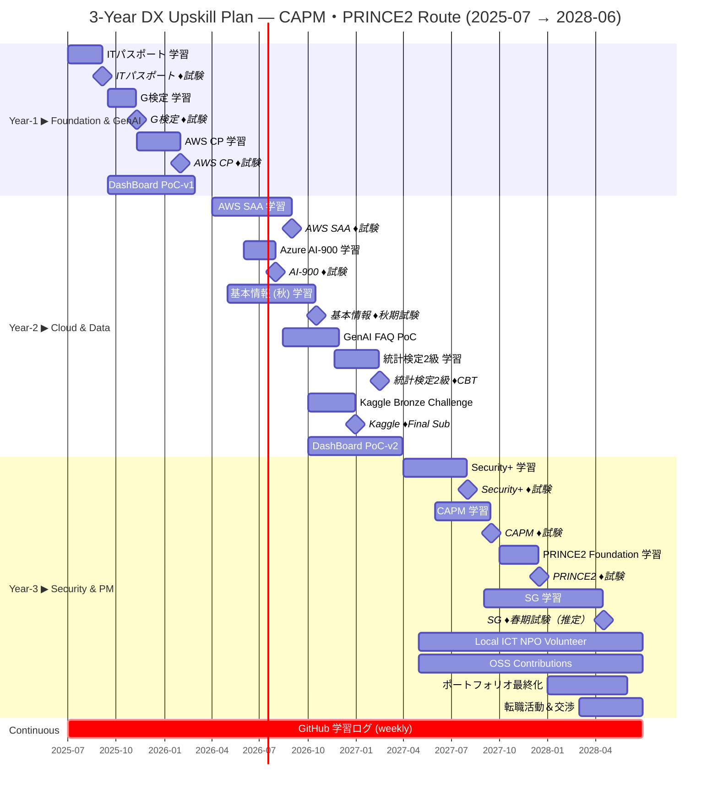

```mermaid
gantt
  title 3-Year DX Upskill Plan — CAPM・PRINCE2 Route (2025-07 → 2028-06)
  dateFormat  YYYY-MM-DD
  axisFormat  %Y-%m

  %% ───────────── Year-1 ─────────────
  section Year-1 ▶ Foundation & GenAI
  ITパスポート 学習           :itp_st,   2025-07-01, 2025-09-04
  ITパスポート ♦試験          :milestone,itp_ex,  2025-09-05, 0d
  G検定 学習                  :gtest_st, 2025-09-15, 2025-11-08
  G検定 ♦試験                 :milestone,gtest_ex,2025-11-09, 0d
  AWS CP 学習                 :awscp,    2025-11-10, 2026-01-31
  AWS CP ♦試験                :milestone,awscp_ex,2026-02-01, 0d
  DashBoard PoC‐v1            :poc1,     2025-09-15, 2026-02-28

  %% ───────────── Year-2 ─────────────
  section Year-2 ▶ Cloud & Data
  AWS SAA 学習                :saa,      2026-04-01, 2026-08-31
  AWS SAA ♦試験               :milestone,saa_ex,  2026-09-01, 0d
  Azure AI-900 学習           :ai900,    2026-06-01, 2026-07-31
  AI-900 ♦試験                :milestone,ai900_ex,2026-08-01, 0d
  基本情報 (秋) 学習          :fe_st,    2026-05-01, 2026-10-16
  基本情報 ♦秋期試験          :milestone,fe_ex,   2026-10-18, 0d
  GenAI FAQ PoC               :faq,      2026-08-15, 2026-11-30
  統計検定2級 学習            :stat2,    2026-11-20, 2027-02-14
  統計検定2級 ♦CBT            :milestone,stat2_ex,2027-02-15, 0d
  Kaggle Bronze Challenge     :kaggle,   2026-10-01, 2026-12-30
  Kaggle ♦Final Sub           :milestone,kaggle_ex,2026-12-31, 0d
  DashBoard PoC‐v2            :poc2,     2026-10-01, 2027-03-31

  %% ───────────── Year-3 ─────────────
  section Year-3 ▶ Security & PM
  Security+ 学習              :secplus,  2027-04-01, 2027-07-31
  Security+ ♦試験             :milestone,secplus_ex,2027-08-01, 0d
  CAPM 学習                   :capm,     2027-06-01, 2027-09-14
  CAPM ♦試験                  :milestone,capm_ex,  2027-09-15, 0d
  PRINCE2 Foundation 学習     :prince2,  2027-10-01, 2027-12-15
  PRINCE2 ♦試験               :milestone,prince2_ex,2027-12-16, 0d
  SG 学習                     :sg_st,    2027-09-01, 2028-04-15
  SG ♦春期試験（推定）        :milestone,sg_ex,    2028-04-16, 0d
  Local ICT NPO Volunteer     :npo,      2027-05-01, 2028-06-30
  OSS Contributions           :oss,      2027-05-01, 2028-06-30
  ポートフォリオ最終化        :portfolio,2028-01-01, 2028-05-31
  転職活動＆交渉              :job,      2028-03-01, 2028-06-30

  %% ─────────── Continuous ───────────
  section Continuous
  GitHub 学習ログ (weekly)    :crit, ghlog,2025-07-01, 2028-06-30
```
