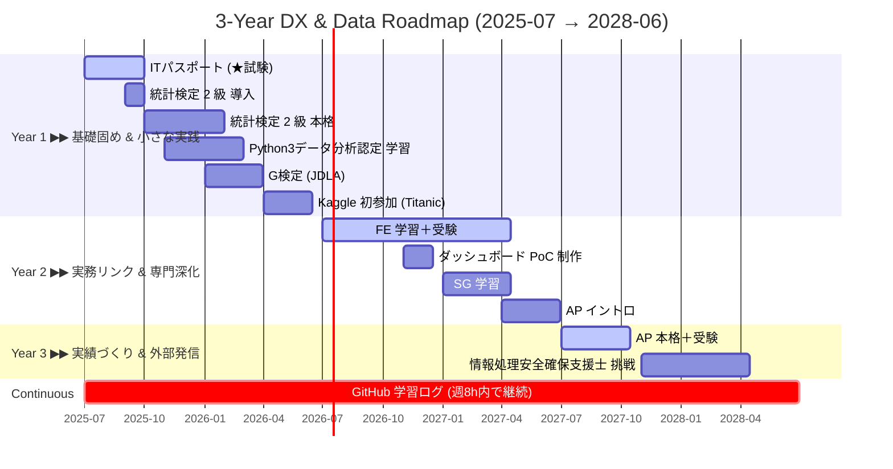

```mermaid
gantt
  title 3-Year DX & Data Roadmap (2025-07 → 2028-06)
  dateFormat  YYYY-MM-DD
  axisFormat  %Y-%m

  %% ──────────────── Year 1 ─────────────────
  section Year 1  ▶▶ 基礎固め & 小さな実践
  ITパスポート (★試験)         :active,  itp,       2025-07-01, 2025-10-01
  統計検定 2 級 導入　       :           stat0,    2025-09-01, 30d
  統計検定 2 級 本格　　     :           stat1,    2025-10-01, 2026-02-01
  Python3データ分析認定 学習          :           pydac,    2025-11-01, 2026-03-01
  G検定 (JDLA)               :           gtest,    2026-01-01, 2026-03-31
  Kaggle 初参加 (Titanic)      :           kaggle,   2026-04-01, 2026-06-15

  %% ──────────────── Year 2 ─────────────────
  section Year 2  ▶▶ 実務リンク & 専門深化
  FE 学習＋受験     :active,  fe,        2026-07-01, 2027-04-15
  ダッシュボード PoC  制作          :           poc,      2026-11-01, 45d
  SG 学習       :           sg,       2027-01-01, 2027-04-15
  AP イントロ        :           ap0,      2027-04-01, 2027-06-30

  %% ──────────────── Year 3 ─────────────────
  section Year 3  ▶▶ 実績づくり & 外部発信
  AP 本格＋受験     :active,  ap1,       2027-07-01, 2027-10-15
  情報処理安全確保支援士 挑戦   :           secsp,    2027-11-01, 2028-04-15

  %% ──────────────── Continuous lane ───────
  section Continuous
  GitHub 学習ログ (週8h内で継続) :crit,    ghlog,    2025-07-01, 2028-06-30
```
