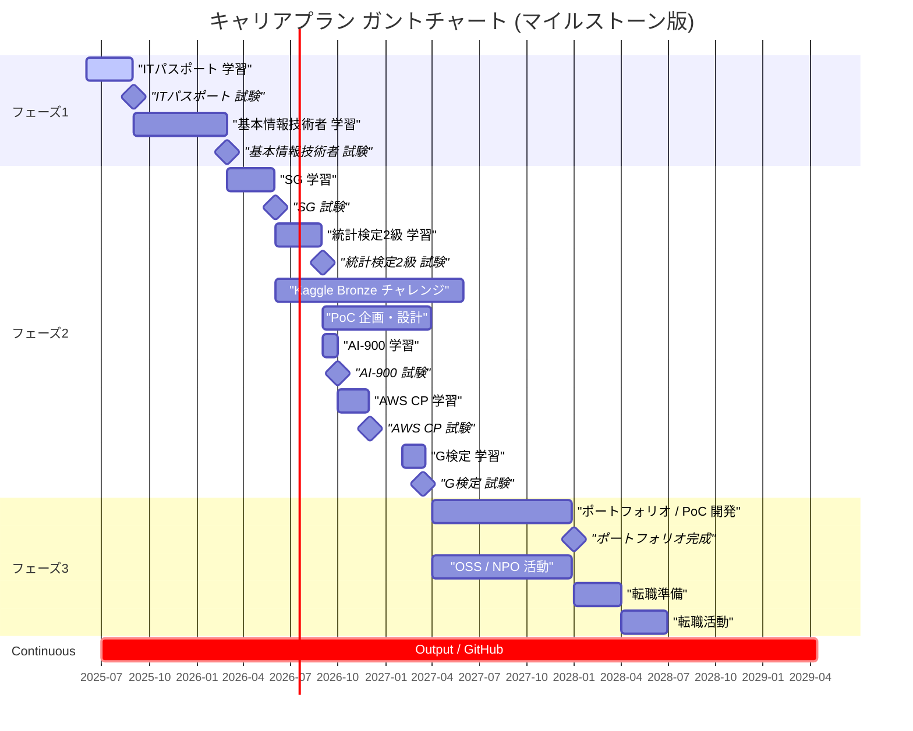

```mermaid
gantt
    title キャリアプラン ガントチャート (マイルストーン版)
    dateFormat  YYYY-MM-DD
    axisFormat  %Y-%m

    %% フェーズ1: IT基礎力
    section フェーズ1
    "ITパスポート 学習"             :active, itp,  2025-06-01, 90d
    "ITパスポート 試験"             :milestone,    2025-09-01, 0d
    "基本情報技術者 学習"           :fe,           2025-09-01, 180d
    "基本情報技術者 試験"           :milestone,    2026-03-01, 0d

    %% フェーズ2: 専門分野
    section フェーズ2
    "SG 学習"                       :sg,           2026-03-01, 90d
    "SG 試験"                       :milestone,    2026-06-01, 0d
    "統計検定2級 学習"              :stat2,        2026-06-01, 90d
    "統計検定2級 試験"              :milestone,    2026-09-01, 0d
    "Kaggle Bronze チャレンジ"       :kaggle,       2026-06-01, 365d
    "PoC 企画・設計"                 :poc,          2026-09-01, 210d
    "AI-900 学習"                   :ai900,        2026-09-01, 30d
    "AI-900 試験"                   :milestone,    2026-10-01, 0d
    "AWS CP 学習"                   :awscp,        2026-10-01, 60d
    "AWS CP 試験"                   :milestone,    2026-12-01, 0d
    "G検定 学習"                    :gtest,        2027-02-01, 45d
    "G検定 試験"                    :milestone,    2027-03-15, 0d

    %% フェーズ3: 実績構築・転職
    section フェーズ3
    "ポートフォリオ / PoC 開発"      :port,         2027-04-01, 270d
    "ポートフォリオ完成"             :milestone,    2028-01-01, 0d
    "OSS / NPO 活動"                :oss,          2027-04-01, 270d
    "転職準備"                       :jobs,         2028-01-01, 90d
    "転職活動"                       :jobsearch,    2028-04-01, 90d

section Continuous
  Output / GitHub: crit, cont, 2025-07-01, 2029-04-15
```
