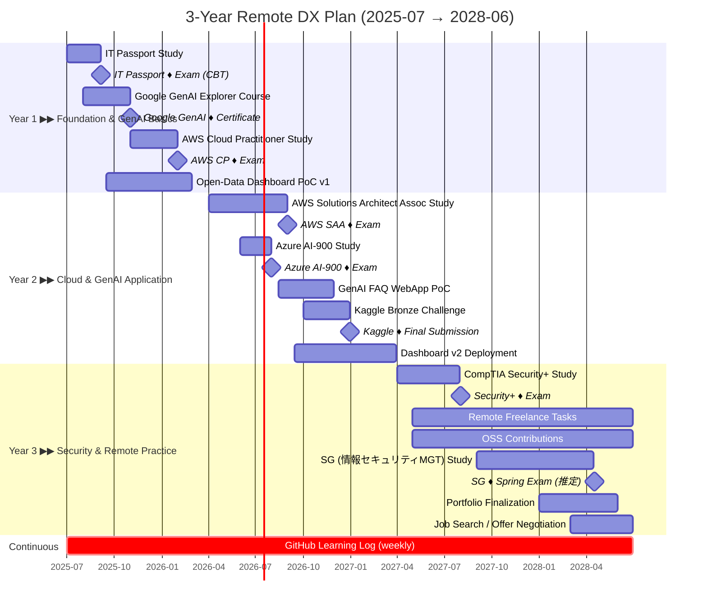

```mermaid
gantt
  title 3-Year Remote DX Plan (2025-07 → 2028-06)
  dateFormat  YYYY-MM-DD
  axisFormat  %Y-%m

  %% ──────────────── Year 1 ─────────────────
  section Year 1 ▶▶ Foundation & GenAI Basics
  IT Passport Study                :itp,      2025-07-01, 2025-09-04
  IT Passport ♦ Exam (CBT)         :milestone,itp_ex,  2025-09-05, 0d
  Google GenAI Explorer Course     :genai,    2025-08-01, 2025-10-31
  Google GenAI ♦ Certificate       :milestone,genai_ex,2025-11-01, 0d
  AWS Cloud Practitioner Study     :aws_cp,   2025-11-01, 2026-01-31
  AWS CP ♦ Exam                    :milestone,aws_cp_ex,2026-02-01, 0d
  Open-Data Dashboard PoC v1       :poc1,     2025-09-15, 2026-02-28

  %% ──────────────── Year 2 ─────────────────
  section Year 2 ▶▶ Cloud & GenAI Application
  AWS Solutions Architect Assoc Study :saa,     2026-04-01, 2026-08-31
  AWS SAA ♦ Exam                    :milestone,saa_ex,  2026-09-01, 0d
  Azure AI-900 Study               :ai900,    2026-06-01, 2026-07-31
  Azure AI-900 ♦ Exam              :milestone,ai900_ex,2026-08-01, 0d
  GenAI FAQ WebApp PoC             :faq,      2026-08-15, 2026-11-30
  Kaggle Bronze Challenge          :kaggle,   2026-10-01, 2026-12-30
  Kaggle ♦ Final Submission        :milestone,kaggle_ex,2026-12-31, 0d
  Dashboard v2 Deployment          :poc2,     2026-09-15, 2027-03-31

  %% ──────────────── Year 3 ─────────────────
  section Year 3 ▶▶ Security & Remote Practice
  CompTIA Security+ Study          :secplus,  2027-04-01, 2027-07-31
  Security+ ♦ Exam                 :milestone,secplus_ex,2027-08-01, 0d
  Remote Freelance Tasks           :freelance,2027-05-01, 2028-06-30
  OSS Contributions                :oss,      2027-05-01, 2028-06-30
  SG (情報セキュリティMGT) Study   :sgstudy,  2027-09-01, 2028-04-15
  SG ♦ Spring Exam (推定)           :milestone,sg_ex,   2028-04-16, 0d
  Portfolio Finalization           :portfolio,2028-01-01, 2028-05-31
  Job Search / Offer Negotiation   :jobsearch,2028-03-01, 2028-06-30

  %% ─────────────── Continuous ──────────────
  section Continuous
  GitHub Learning Log (weekly)     :crit, ghlog, 2025-07-01, 2028-06-30
```
