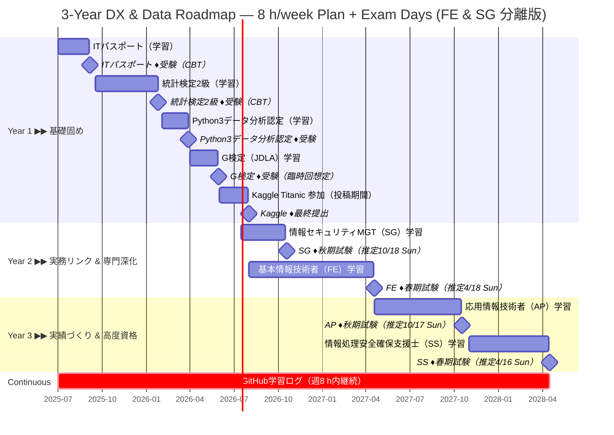

```mermaid
gantt
  title 3-Year DX & Data Roadmap — 8 h/week Plan + Exam Days (FE & SG 分離版)
  dateFormat  YYYY-MM-DD
  axisFormat  %Y-%m

  %% ───────────── Year 1 ─────────────
  section Year 1 ▶▶ 基礎固め
  ITパスポート（学習）                :itp,   2025-07-01, 2025-09-04
  ITパスポート ♦受験（CBT）            :milestone, itp_ex, 2025-09-05, 0d
  統計検定2級（学習）                 :stat,  2025-09-16, 2026-01-24
  統計検定2級 ♦受験（CBT）            :milestone, stat_ex, 2026-01-25, 0d
  Python3データ分析認定（学習）        :pydac, 2026-02-01, 2026-03-28
  Python3データ分析認定 ♦受験          :milestone, py_ex, 2026-03-29, 0d
  G検定（JDLA）学習                  :gtest, 2026-04-01, 2026-05-29
  G検定 ♦受験（臨時回想定）            :milestone, gtest_ex, 2026-05-30, 0d
  Kaggle Titanic 参加（投稿期間）      :kaggle,2026-06-01, 2026-07-30
  Kaggle ♦最終提出                   :milestone, kaggle_ex, 2026-07-31, 0d

  %% ───────────── Year 2 ─────────────
  section Year 2 ▶▶ 実務リンク & 専門深化
  情報セキュリティMGT（SG）学習        :sg,     2026-07-15, 2026-10-16
  SG ♦秋期試験（推定10/18 Sun）        :milestone, sg_ex, 2026-10-18, 0d
  基本情報技術者（FE）学習            :fe,     2026-08-01, 2027-04-17
  FE ♦春期試験（推定4/18 Sun）         :milestone, fe_ex, 2027-04-18, 0d

  %% ───────────── Year 3 ─────────────
  section Year 3 ▶▶ 実績づくり & 高度資格
  応用情報技術者（AP）学習            :ap,     2027-04-19, 2027-10-16
  AP ♦秋期試験（推定10/17 Sun）        :milestone, ap_ex, 2027-10-17, 0d
  情報処理安全確保支援士（SS）学習     :secsp,  2027-11-01, 2028-04-15
  SS ♦春期試験（推定4/16 Sun）         :milestone, sec_ex, 2028-04-16, 0d

  %% ───────────── Continuous ──────────
  section Continuous
  GitHub学習ログ（週8 h内継続）        :crit, ghlog, 2025-07-01, 2028-04-16
```
