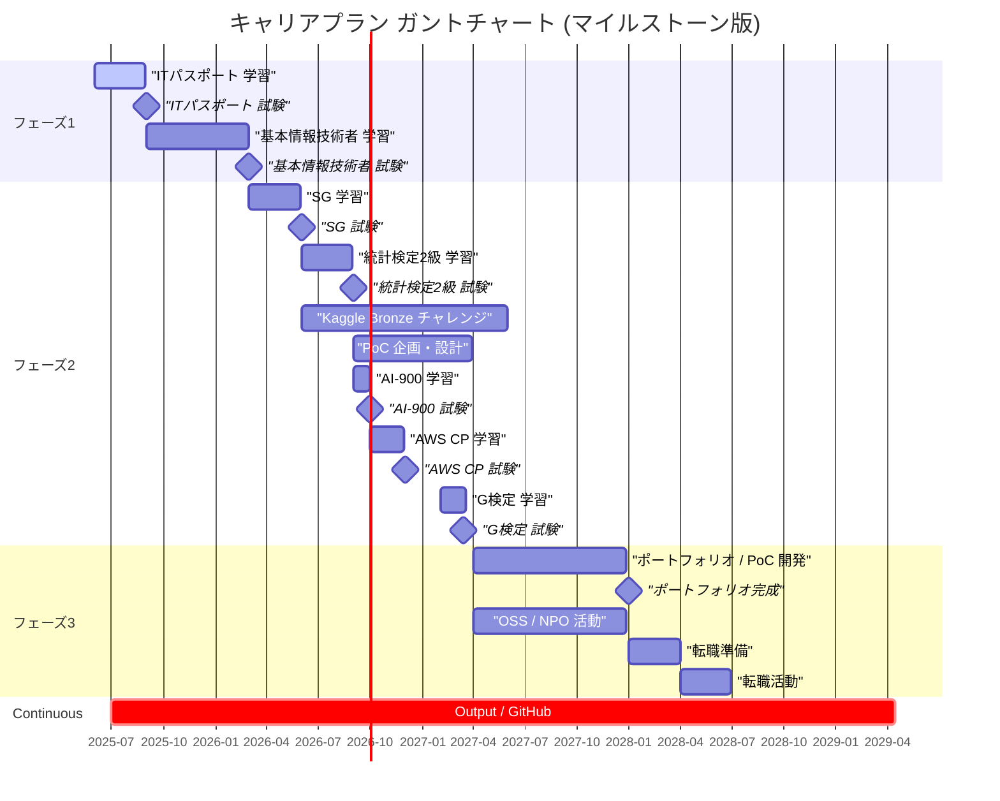

# LearningLog - FPS優先ミニ実装

## 実装した優先度上位の提案（4件）
1. **パーティクル数を固定上限化**（`MAX_PARTICLES`）
2. **オブジェクトプール化**（GC負荷を抑えてFPS安定）
3. **`dt`クランプ**（タブ復帰時のフレーム落ちスパイク抑制）
4. **短く耳に刺さらない効果音**（短尺・低め・ローパス）

## 起動
```bash
python3 -m http.server 4173
# ブラウザで http://localhost:4173
```

## 変更点（要約）
- `index.html`: Canvas と最小UI（Burstボタン・FPS表示）を追加
- `src/game.js`: 描画ループ、プーリング、粒子上限、FPS表示を実装
- `src/audio.js`: WebAudioで短く柔らかい効果音を実装

---

## 以前の計画メモ


