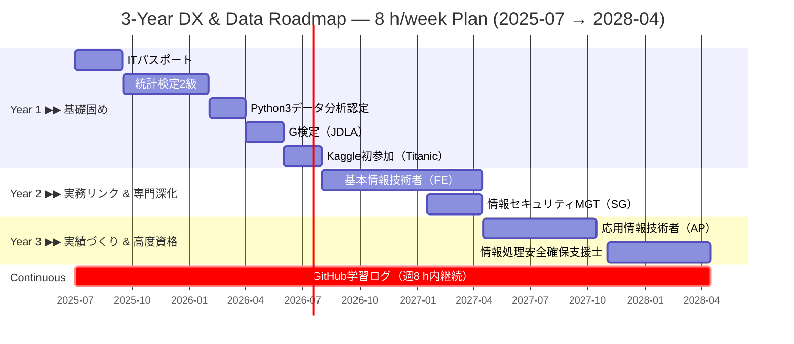

```mermaid
gantt
  title 3-Year DX & Data Roadmap — 8 h/week Plan (2025-07 → 2028-04)
  dateFormat  YYYY-MM-DD
  axisFormat  %Y-%m

  %% ──────────────── Year 1 ─────────────────
  section Year 1 ▶▶ 基礎固め
  ITパスポート                :itp,     2025-07-01, 2025-09-15
  統計検定2級             :stat,   2025-09-16, 2026-01-31
  Python3データ分析認定         :pydac,   2026-02-01, 2026-03-31
  G検定（JDLA）               :gtest,   2026-04-01, 2026-05-31
  Kaggle初参加（Titanic）       :kaggle,  2026-06-01, 2026-07-31

  %% ──────────────── Year 2 ─────────────────
  section Year 2 ▶▶ 実務リンク & 専門深化
  基本情報技術者（FE）          :fe,      2026-08-01, 2027-04-15
  情報セキュリティMGT（SG）     :sg,      2027-01-16, 2027-04-15

  %% ──────────────── Year 3 ─────────────────
  section Year 3 ▶▶ 実績づくり & 高度資格
  応用情報技術者（AP）          :ap,     2027-04-16, 2027-10-15
  情報処理安全確保支援士       :secsp,   2027-11-01, 2028-04-15

  %% ─────────────── Continuous lane ───────
  section Continuous
  GitHub学習ログ（週8 h内継続） :crit,    ghlog,   2025-07-01, 2028-04-15
```
