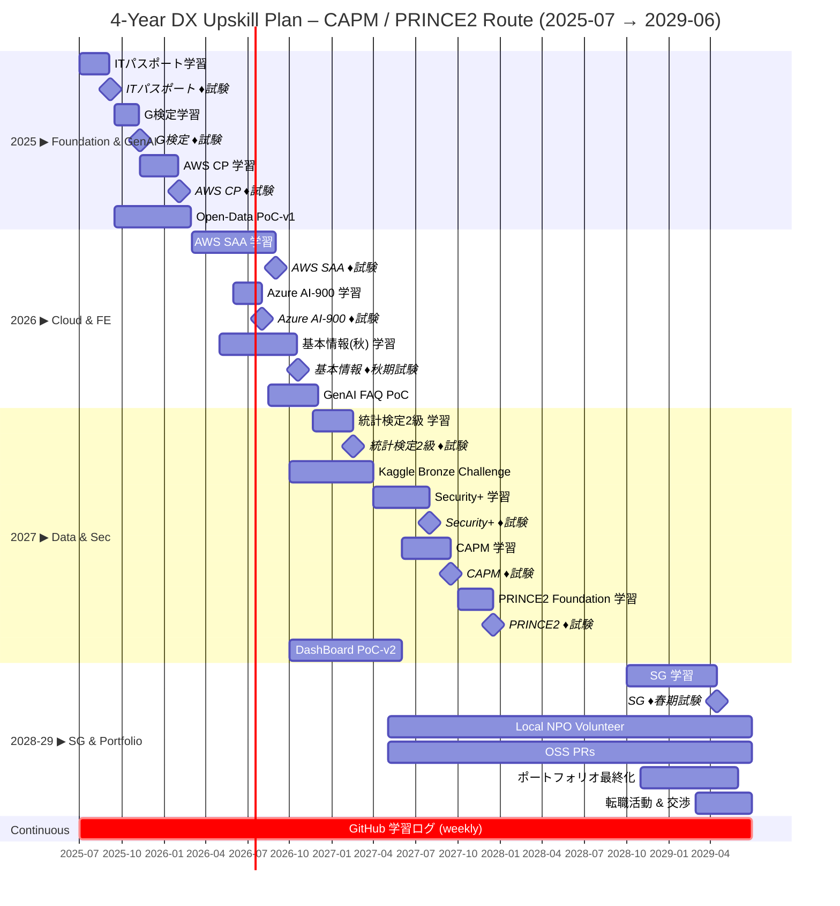

```mermaid
gantt
  title 4-Year DX Upskill Plan – CAPM / PRINCE2 Route (2025-07 → 2029-06)
  dateFormat YYYY-MM-DD
  axisFormat %Y-%m

  %% ───────── Year-1 ─────────
  section 2025 ▶ Foundation & GenAI
  ITパスポート学習            :itp_st,   2025-07-01, 2025-09-04
  ITパスポート ♦試験          :milestone,itp_ex,  2025-09-05, 0d
  G検定学習                  :gtest,    2025-09-15, 2025-11-08
  G検定 ♦試験                :milestone,gtest_ex,2025-11-09, 0d
  AWS CP 学習                :awscp,    2025-11-10, 2026-02-01
  AWS CP ♦試験               :milestone,awscp_ex,2026-02-02, 0d
  Open-Data PoC-v1           :poc1,     2025-09-15, 2026-02-28

  %% ───────── Year-2 ─────────
  section 2026 ▶ Cloud & FE
  AWS SAA 学習               :saa,      2026-03-01, 2026-08-31
  AWS SAA ♦試験              :milestone,saa_ex,  2026-09-01, 0d
  Azure AI-900 学習          :ai900,    2026-06-01, 2026-07-31
  Azure AI-900 ♦試験         :milestone,ai900_ex,2026-08-01, 0d
  基本情報(秋) 学習          :fe_st,    2026-05-01, 2026-10-17
  基本情報 ♦秋期試験         :milestone,fe_ex,   2026-10-18, 0d
  GenAI FAQ PoC              :faq,      2026-08-15, 2026-11-30

  %% ───────── Year-3 ─────────
  section 2027 ▶ Data & Sec
  統計検定2級 学習           :stat2,    2026-11-20, 2027-02-14
  統計検定2級 ♦試験          :milestone,stat2_ex,2027-02-15, 0d
  Kaggle Bronze Challenge    :kaggle,   2026-10-01, 2027-03-31
  Security+ 学習             :secplus,  2027-04-01, 2027-07-31
  Security+ ♦試験            :milestone,secplus_ex,2027-08-01, 0d
  CAPM 学習                  :capm,     2027-06-01, 2027-09-14
  CAPM ♦試験                 :milestone,capm_ex,  2027-09-15, 0d
  PRINCE2 Foundation 学習     :prince2,  2027-10-01, 2027-12-15
  PRINCE2 ♦試験              :milestone,prince2_ex,2027-12-16, 0d
  DashBoard PoC-v2           :poc2,     2026-10-01, 2027-05-31

  %% ───────── Year-4 ─────────
  section 2028-29 ▶ SG & Portfolio
  SG 学習                    :sg_st,    2028-10-01, 2029-04-14
  SG ♦春期試験               :milestone,sg_ex,   2029-04-15, 0d
  Local NPO Volunteer        :npo,      2027-05-01, 2029-06-30
  OSS PRs                    :oss,      2027-05-01, 2029-06-30
  ポートフォリオ最終化       :portfolio,2028-11-01, 2029-05-31
  転職活動 & 交渉            :job,      2029-03-01, 2029-06-30

  %% ───────── Continuous ─────────
  section Continuous
  GitHub 学習ログ (weekly)   :crit,ghlog,2025-07-01, 2029-06-30

```
